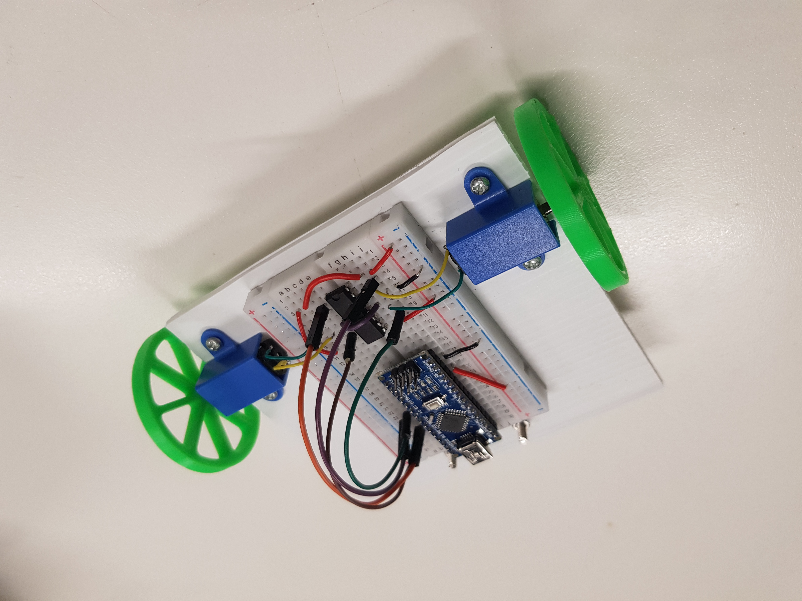

# TinyBot

TinyBot is a small robot that you build step by step with the help of a guide provided by the Curtin Robotics Club!

The guide is in this repository, and is also linked [here](https://github.com/curtinrobotics/TinyBotGuide/blob/master/TinyBot.pdf)!
